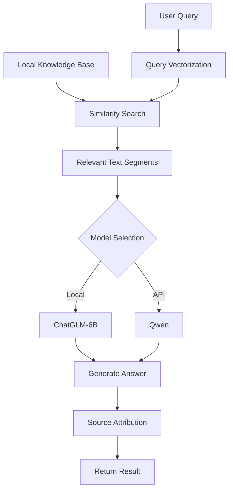

```markdown
# 🧬 Protein Research Document QA Assistant

<div align="center">
  
  
  
  
</div>

## 📌 Project Overview

An intelligent document QA system designed for protein research, combining local LLMs (ChatGLM-6B) and cloud API models (Qwen). Key features:

- 🔒 **Full offline operation** - Sensitive data never leaves local environment
- 🤖 **Dual-model engine** - Seamless switch between local and cloud models
- 🧠 **Smart RAG architecture** - Retrieval-Augmented Generation for protein documents
- 📚 **Multi-document support** - Process multiple research papers simultaneously
- 🔍 **Answer provenance** - Source documents and reference locations provided

## ✨ Core Features

### 🔒 Offline Private Deployment
- Local model handles sensitive data without internet
- Full document processing pipeline on-premise
- Zero data transmission risk, enterprise-compliant

### 🤖 Multi-Model Support
| Model Type | Model Name | Use Case | Characteristics |
|------------|------------|----------|-----------------|
| 🖥️ Local | ChatGLM-6B | Sensitive data/Offline | 14GB size, no data leakage |
| ☁️ Web API | Qwen | Complex queries | Enhanced reasoning capabilities |
| 🔍 Embedding | M3E-base | Text vectorization | Chinese-optimized, efficient retrieval |

### 📚 Local Knowledge Base QA
1. **Document Processing**:
   - PDF text extraction and cleaning
   - Smart chunking
   - Metadata extraction (filename, page number)
 
2. **Knowledge Building**:
   - FAISS vector index construction
   - Text embeddings via M3E model
   - Dynamic knowledge base updates

3. **Intelligent QA**:
   - Protein-specific question answering
   - Strict prompt-based hallucination prevention
   - Source attribution (document + page)

### 🧠 RAG Architecture


### 📝 Conversation Management
- Full conversation history
- One-click history clearance
- Context-aware continuous dialogue
- Expandable/collapsible sources

## ⚙️ Installation Guide

### 1. Create Conda Environment
```bash
conda create -n protein-qa python=3.10
conda activate protein-qa
```

### 2. Install Dependencies
```bash
pip install -r requirements.txt
```

For China users:
```bash
pip install -r requirements.txt -i https://pypi.tuna.tsinghua.edu.cn/simple
```

### 3. Download Models
#### FAISS Vector Database
```bash
git clone https://github.com/facebookresearch/faiss.git
cd faiss
cmake -B build .
make -C build -j faiss
make -C build -j swigfaiss
cd build/faiss/python && python setup.py install
```

#### M3E Embedding Model
```bash
git lfs install
git clone https://huggingface.co/moka-ai/m3e-base
```

#### ChatGLM-6B Local Model (~14GB)
```bash
git lfs install
git clone https://huggingface.co/THUDM/chatglm-6b
```

## 🚀 Quick Start

### 1. Configure Environment
Create `.env` file:
```env
# Qwen API key (for API mode)
DASHSCOPE_API_KEY=your_api_key_here

# Local model path
LOCAL_MODEL_PATH=./models/chatglm-6b
```

### 2. Launch Application
```bash
streamlit run app.py
```

### 3. Usage Workflow
1. **Upload Documents**:
   - Click "Upload PDF Documents"
   - Select protein research PDFs
   - System auto-parses and builds knowledge base

2. **Query Examples**:
   ```python
   # Sample queries:
   - "Explain structural differences between α-helices and β-sheets"
   - "List key factors influencing protein folding"
   - "Describe chaperone roles in protein folding"
   ```

3. **Operations**:
   - Switch local/API mode: Top-right selector
   - Clear history: "🗑️ Clear History" button
   - View sources: "Show Sources" under answers

## 📂 File Structure
```
protein-qa/
├── app.py                  # Main application
├── document_processor.py   # Document processing
├── rag_engine.py           # RAG core engine
├── local_model.py          # Local model interface
├── api_model.py            # Web API interface
├── models/                 # Model storage
│   ├── chatglm-6b/         # ChatGLM-6B
│   └── m3e-base/           # M3E embedding model
├── knowledge_base/         # Vector storage
│   ├── index.faiss         # FAISS index
│   └── metadata.pkl        # Document metadata
├── requirements.txt        # Python dependencies
├── .env                    # Environment config
└── README.md               # Documentation
```

## ⚙️ Configuration Options
Modify in `app.py`:
```python
# Model selection (local/api)
MODEL_MODE = "local"

# Text processing
CHUNK_SIZE = 500      # Text chunk size
CHUNK_OVERLAP = 100   # Chunk overlap
HALLUCINATION_PROMPT = "Answer based ONLY on provided context"  # Anti-hallucination

# Knowledge base path
KNOWLEDGE_BASE_PATH = "./knowledge_base"
```

## ⚠️ Important Notes

1. **Hardware Requirements**:
   - Local mode: ≥16GB RAM (32GB recommended)
   - GPU acceleration: Requires CUDA 11+
   - Disk space: Reserve ≥20GB (including models)

2. **Security**:
   - Local models make zero external network requests
   - API mode sends only query text (no documents)

3. **Document Limitations**:
   - Standard PDF text only (no scanned images)
   - Recommended ≤50 pages/document
   - Optimized for English/Chinese content

4. **First-time Use**:
   - Local model loads in 5-10 minutes
   - Knowledge base build time scales with document size
   - Start with small documents for testing

## ❓ FAQ

**Q: How is research data secured?**
A: Local mode processes all data on your device with zero storage/transmission. API mode sends only query text.

**Q: How are hallucinations prevented?**
A: The system uses strict prompt constraints: "Answer based ONLY on provided context".

**Q: What document types are supported?**
A: Currently supports PDF research papers and technical documents.

**Q: How to update the knowledge base?**
A: Upload new documents and click "Rebuild Knowledge Base" or delete `knowledge_base` directory.

**Q: Qwen API pricing?**
A: Qwen charges per token. Refer to [official pricing](https://help.aliyun.com/zh/dashscope/developer-reference/tongyi-thousand-questions-metering-and-billing). Local model is completely free.

## 📜 License

[MIT License](LICENSE) - Free for academic and commercial use

---

**Research Tip**: Add quick links to protein databases (UniProt, PDB, RCSB) in the sidebar for rapid access! 🧪🔬
```
