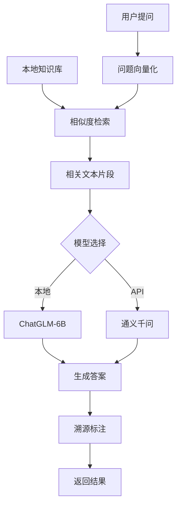

# 🧬 蛋白质研究文档问答系统

<div align="center">
  
  
  
  
</div>

## 📌 项目概述

专为蛋白质研究设计的智能文档问答系统，结合本地大模型（ChatGLM-6B）和云端API模型（通义千问）。核心特点：

- 🔒 **完全离线运行** - 敏感数据不离开本地环境
- 🤖 **双模型引擎** - 本地与云端模型无缝切换
- 🧠 **智能RAG架构** - 基于蛋白质文档的检索增强生成
- 📚 **多文档支持** - 同时处理多篇研究文献
- 🔍 **答案溯源** - 提供答案来源和参考位置

## ✨ 核心功能

### 🔒 离线私有化部署
- 本地模型处理敏感数据，无需网络连接
- 文档解析、向量化、问答全流程本地化
- 零数据外传风险，符合企业安全规范

### 🤖 多模型支持
| 模型类型 | 模型名称 | 使用场景 | 特点 |
|---------|---------|---------|------|
| 🖥️ 本地模型 | ChatGLM-6B | 敏感数据处理/离线环境 | 无数据泄露 |
| ☁️ 网页API | 通义千问 | 复杂问题处理 | 更强的推理能力 |
| 🔍 嵌入模型 | M3E-base | 文本向量化 | 中文优化，高效检索 |

### 📚 本地知识库问答
1. **文档处理**：
   - PDF文本提取与清洗
   - 智能分块
   - 元数据提取（文件名、页码）
 
2. **知识构建**：
   - 使用FAISS构建向量索引
   - M3E模型生成文本嵌入
   - 动态更新知识库

3. **智能问答**：
   - 蛋白质专业问题解答
   - 严格Prompt约束防止幻觉
   - 答案来源标注（文档+页码）

### 🧠 RAG架构流程


### 📝 对话管理
- 完整对话历史记录
- 一键清空对话历史
- 可展开/折叠的答案来源

## ⚙️ 安装指南

### 1. 创建Conda环境
```bash
conda create -n protein-qa python=3.10
conda activate protein-qa
```

### 2. 安装依赖
```bash
pip install -r requirements.txt
```

国内用户推荐使用清华镜像：
```bash
pip install -r requirements.txt -i https://pypi.tuna.tsinghua.edu.cn/simple
```

### 3. 下载模型
#### M3E嵌入模型
```bash
git lfs install
git clone https://huggingface.co/moka-ai/m3e-base
```

#### ChatGLM-6B本地模型
```bash
git lfs install
git clone https://huggingface.co/THUDM/chatglm-6b
```

## 🚀 快速开始

### 1. 配置环境
# 通义千问API密钥（API模式需要）
DASHSCOPE_API_KEY=your_api_key_here

# 本地模型路径
model_path=./models/chatglm-6b
```

### 2. 启动网页应用
```bash
streamlit run protein_qa_assistant.py
```

## ⚠️ 重要说明

1. **硬件要求**：
   - 本地模式：≥16GB内存（推荐32GB）
   - GPU加速：需CUDA 11+
   - 磁盘空间：预留≥20GB（含模型）

2. **文档限制**：
   - 本地支持TXT、PDF，API支持PDF
   - 建议≤50页/文档
   - 中英文文档兼容

3. **首次使用**：
   - 本地模型加载需几分钟
   - 知识库构建时间与文档大小成正比
   - 建议从小型文档开始测试

## ❓ 常见问题

**Q: 如何保证研究数据安全？**
A: 本地模式所有数据处理均在设备完成，无数据存储或传输。API模式仅发送问题文本和经处理的文本片段，符合企业数据安全要求。

**Q: 如何防止模型编造答案？**
A: 系统使用严格Prompt约束："仅基于提供的文档内容回答"。

**Q: 支持哪些文档格式？**
A: 目前支持PDF格式的研究论文和技术文档。

## 📜 许可证

[MIT 许可证](LICENSE) - 学术和商业场景免费使用

---

**研究提示**：在侧边栏添加蛋白质数据库链接（如UniProt、PDB、RCSB），实现快速查询！ 🧪🔬
```
